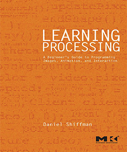

Daniel Shiffman is the author of two books.

# The Nature of Code

A book (print, pdf, html) about modeling natural behavior through code.

- Visit the [_Nature of Code_ website](http://natureofcode.com)
- [_The Nature of Code_ examples on GitHub](https://github.com/shiffman/The-Nature-of-Code-Examples)
- [Source code for _The Nature of Code_ book on GitHub](https://github.com/shiffman/The-Nature-of-Code)
- _The Nature of Code_ was created with the [Magic Book Project](https://github.com/runemadsen/Magic-Book-Project)
- [Buy _The Nature of Code_ on Amazon.com](http://www.amazon.com/gp/product/0985930802/ref=as_li_ss_tl?ie=UTF8&camp=1789&creative=390957&creativeASIN=0985930802&linkCode=as2&tag=shiffman-20)

# Learning Processing

A beginner's guide to programming images, animation and interaction.

- Visit the [_Learning Processing_ website](http://learningprocessing.com)
- [_Learning Processing_ examples on GitHub](https://github.com/shiffman/LearningProcessing)
- [Buy _Learning Processing_ on Amazon.com](http://www.amazon.com/gp/product/0123736021/ref=as_li_ss_tl?ie=UTF8&camp=1789&creative=390957&creativeASIN=0123736021&linkCode=as2&tag=shiffman-20)
