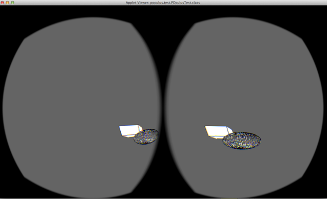

2014 marks [The Processing Foundation](http://processing.org)'s fourth year participating in [Google Summer of Code](https://developers.google.com/open-source/soc/).  Following is a summary of the eleven projects, in alphabetical order by project name, completed this summer by a terrific group of students.

N) [POculus](https://github.com/pratik9891/ProcessingOculus) by [Pratik Sharma](http://pratikgsoc.wordpress.com), mentored by Elie Zananiri. POculus provides an Oculus renderer for Processing. Any P3D sketch can be made Oculus ready by using the POculus renderer. ([Source Code](https://github.com/pratik9891/ProcessingOculus)).

<iframe src="//player.vimeo.com/video/104029693" width="500" height="281" frameborder="0" webkitallowfullscreen mozallowfullscreen allowfullscreen></iframe>

N) [Loom](http://chrisjr.github.io/loom) by [Chris Johnson-Roberson](http://www.chrisjr.org/), mentored by R. Luke DuBois. Loom lets you create and manipulate patterns of timed events. These patterns can be mapped to audiovisual output, transformed in various ways, and recorded to enable non-realtime synthesis and synchronized video. ([Source code](http://github.com/chrisjr/loom).)

N) **[PDE X for Processing 3.0](http://www.mkmoharana.com/2014/08/google-summer-of-code-2014-its-wrap.html)** by [Manindra Moharana](http://www.mkmoharana.com/), mentored by [Daniel Shiffman](http://shiffman.net/) - [PDE X](http://www.mkmoharana.com/2013/09/announcing-pde-x.html) is a Processing mode that introduces advanced IDE features like code completion, refactoring, live error checking, debugger and more. The goal of the project was to bring PDE X to a stable state and make it the default editor for Processing 3.0. The main focus was on fixing the last remaining bugs and tweaking/refining what was already present. A few new features were also introduced. Please see [Manindra's post](http://www.mkmoharana.com/2014/08/google-summer-of-code-2014-its-wrap.html) for more details on what was accomplished. ([Source code](https://github.com/processing/processing/commits/master?author=Manindra29))

N) **[Contributions Manager: Reloaded](http://www.joelmoniz.com/gsoc-2014/)** by [Joel Moniz](http://www.joelmoniz.com), mentored by [Florian Jenett](http://www.florianjenett.de/) - The Contributions Manager enables easy and convenient installation, removal and update of contributions (Libraries, Tools and Modes) from within the PDE. This summer saw the introduction of a few new features to the Contributions Manager, such as the addition, removal and update of Tools and Modes without a restart, a new "examples-package"-type contribution, and highlighting contributions. For an in-depth view of changes and how they were undertaken, please refer [this](http://www.joelmoniz.com/gsoc-2014/) webpage.([Source code](https://github.com/processing/processing/commits/master?author=joelmoniz))

